# ceph 部署

关于Ceph的介绍，在本内容中，我们不在赘述。

本项目使用5台机器，组成一个超融合环境，里面运行一些服务，使用SDN进行网络管理。

## 一、硬件配置

因为成本的关系，硬件采用老型号机器。

| 类型   | 型号                                                     | 数量 |
| -------- | ---------------------------------------------------------- | ------ |
| 服务器 | 超聚变 2288H v5                                       |    1 |
| CPU    | 英特尔® 至强® 金牌 6148 处理器27.5M 高速缓存，2.40 GHz |    2 |
| 内存   | 三星 32G 2Rx4 PC4 -2933Y                                 |    8 |
| 硬盘   | 东芝HDWT740 S300系列5400转128m 3.5 SATA3                 |    8 |
| 网卡   | 华为SP333 双口25G SFP28 PCI-E 8X                         |    2 |
| 电源   | 华为PAC9000S12-BE 900W电源                               |    2 |
| 阵列卡 | 华为SR430C BC61ESMLB                                     |    1 |
| 系统盘 | INTEL S3510 120G MLC 200TBW SATA3 SSD                    |    2 |
| 缓存盘 | 三星1725B PCIE3.0 X8 1.6t AIC PCIE 8X                    |    1 |
| 交换机1 | H3c  S6520-24S-SI                   |    1 |
| 交换机2 | H3c  S1850v2-28P-HPWR-EI                   |    1 |


## 二、Ceph设计

我们使用HDD来节省成本，使用U.2作为缓存盘

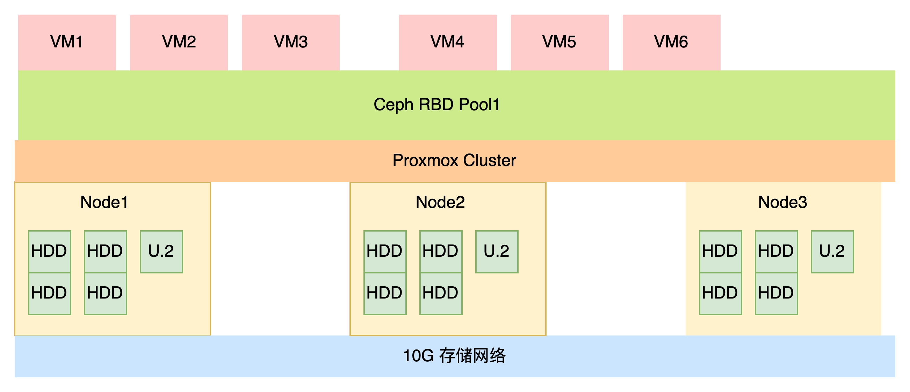

缓存盘对于全HDD的ceph场景性能提升巨大。原理如下图所示

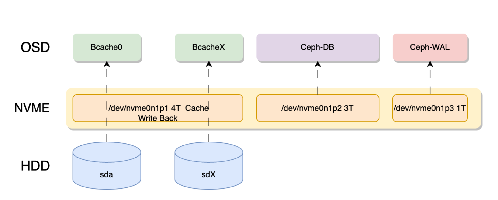

上图使用一块7.68T的 nvme 分割成3部分，4T分区作为bcache。

其他的分别做ceph osd的DB和wal存储。

因为PVE使用LVM管理 DB wal，所以我们不需要单独去划分对应的分区，直接指定一个分区，pve会自动在这个分区内创建LVM存储ceph db。


### SSD缓存的选择 

#### SSD的选型
通常来说SSD的性能存在瓶颈，如果要使用ssd做为缓存，那么最好使用sas ssd。

如果是NVME，推荐使用企业级的NVME，如果是M.2这种，请勿尝试。 使用PCIE4.0的 U.2无疑是一个非常好的选择，如CD6。

因为成本关系，我们还是使用1.6t的1725b aic版本。所谓aic版本就是他像显卡一样，是一个pcie设备，可以插到PCI槽当中。

#### SSD的大小

按照BlueStore部署的建议，db存储元数据，最好大于等于主存储容量的4%。如果是4T，那么db大小就是160G。

但我们存放虚拟机数据，用的是RBD，db的大小为物理盘的1-2%都可以，如果是4t，db要求80G，我们有8块4T,那么DB就应该是640G。如果是按照官方建议，我们的NVME的db盘 就至少要3.2t了。

wal的大小通常没什么要求。有个20-30G就足够了。

我们希望bcache缓存能完全接管顺序和随机io，因此bcache的缓存大小应该足够大。单盘5%~10%最佳。例如4t的磁盘，缓存大小应在200G~400g之间，8盘就要在1.6t以上了。

#### SSD的数量。

如果是单盘缓存，存在硬盘故障的风险，所以不建议使用消费级的SSD和消费级的NVME。

正常情况下，是需要防止缓存盘故障的，建议是多块盘做缓存。

例如有8块4T，我们有2块SSD，那么ssd0做 hdd0-hdd3的缓存，ssd1 做hdd4-hdd7的缓存。

最保险的方式，可以使用2块SAS或者sata盘使用硬件raid1，来做缓存。这样缓存盘就不容易坏。但是需要高性能的raid卡。

但如果你的ceph集群数量足够，且规范部署，一块企业缓存盘也行。假设缓存盘故障，代表这个节点故障，实际上不影响整个集群的健康的，ceph会自动修复。但推荐使用2块更加的安全。

### 选择 1725b的原因

本项目的场景热数据较少，只是跑一些常驻的服务，也没有桌面需求，我们还是使用1.6t的1725b aic版本。

拿500G做读写缓存，拿700G做osd的DB，拿200G做wal存储。这样的分配比较合理，

## 三、网络架构

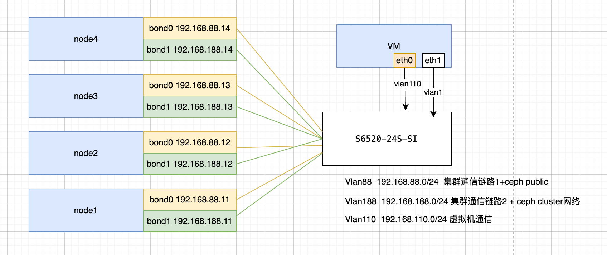

::: info
在最佳实践中，ceph交换机应该做主备，在本case中，因为项目条件限制，所以单台。

例如两台S6520 互相堆叠，双网口互相连两交换机做堆叠。
:::


我们利用PVE SDN的功能，可以将交换机设置为Trunk模式，这样虚拟机的流量或者集群通信的链路，就可以自由的在PVE中设置。而不用去设置交换机，但是如果要精细的控制交换机流量，就必须去配置交换机。

可以看下面的逻辑，vmbrX 和交换机 只是充当一个纯流量交换设备。 网桥上的流量管理由通过SDN来控制。


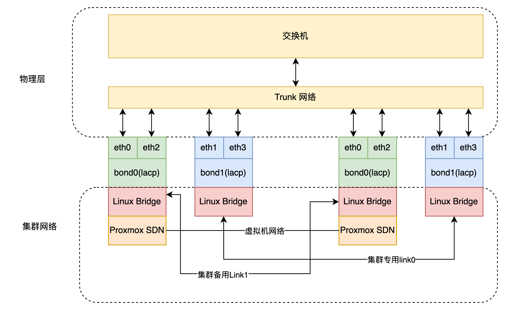


### 交换机配置


下面是H3C 的操作示例

::: details 展开查看过程

先创建ladp组
```
interface Bridge-Aggregation 10 
```
将2个网卡加入到聚合组当中
```
interface  range xge1/0/21 to xge1/0/22
port link-aggregation group 10 force
```
设置为动态聚合
```                                             
link-aggregation mode dynamic                                         
link-aggregation selected-port minimum 1                              
link-aggregation selected-port maximum 2
```
设置 trunk                                               
```
port link-type trunk                                                  
port trunk permit vlan all      
```
:::

### PVE bond

服务器自带2口10G SFP+网口，因此可以和PCIE的SP333 互组linux bond。

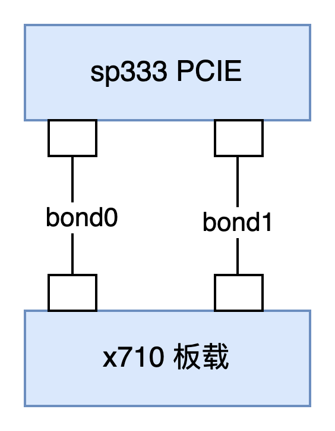

这2个bond仅做集群流量使用 下面是PVE的网络配置示例

::: details 展开查看 PVE 网络示例

```
auto lo
iface lo inet loopback

iface ens18 inet manual

auto eno1
iface eno1 inet manual

auto eno2
iface eno2 inet manual

iface eno3 inet manual

iface eno4 inet manual

auto ens3f0
iface ens3f0 inet manual

auto ens3f1
iface ens3f1 inet manual

auto bond1
iface bond1 inet manual
        bond-slaves eno2 ens3f0
        bond-miimon 100
        bond-mode 802.3ad
        bond-xmit-hash-policy layer2+3

auto bond0
iface bond0 inet manual
        bond-slaves eno1 ens3f1
        bond-miimon 100
        bond-mode 802.3ad
        bond-xmit-hash-policy layer2+3

auto bond1.188
iface bond1.188 inet static
        address 192.168.188.11/24
# bond1 vlan 188  ceph 公共网络

auto bond0.88
iface bond0.88 inet static
        address 192.168.88.11/24
# bond0 vlan 88 ceph cluster网络，处理osd内部流量
```

:::


## 四、安装ceph

使用pve-iso-builder项目，可以构建自带ceph的iso镜像，不用再次安装ceph。如果原来的系统，没有ceph，请参考下面方式进行安装


::: danger
请勿从网页上安装ceph
:::

从网页上安装会破坏ceph软件源。


::: details 展开查看过程

我们推荐安装最新的版本，如ceph-squid版本。

添加软件源

```
echo "deb https://download.lierfang.com/pxcloud/pxvirt bookworm ceph-squid" > /etc/apt/sources.list.d/pxvirt-ceph.list
```

在节点上安装ceph

```
apt update
apt install ceph -y
```

如果节点数量很多，也可以使用`pvessh`命令批量操作

```
pvessh echo "deb https://download.lierfang.com/pxcloud/pxvirt bookworm ceph-squid" > /etc/apt/sources.list.d/pxvirt-ceph.list
pvessh apt update
pvessh apt install ceph -y
```
:::

## 五、 配置ceph

这时候 就可以在网页上设置ceph了。

注意把集群网络和公共网络分开。

## 六、配置Bcache缓存

这里我们拿500G做bcache，拿600G做osd的DB （每个硬盘75G的db），拿200G做wal存储(每个硬盘25G)。

我们使用sgdisk工具进行分区。
```
# 清除磁盘数据
dd if=/dev/zero of=/dev/nvme0n1 bs=1M count=16

# 创建GPT分区表
sgdisk -ZG /dev/nvme0n1
# 创建bcache分区
sgdisk -a1 -n1:1M:+500G  /dev/nvme0n1  
# 创建db分区
sgdisk -a1 -n2:501G:+600G  /dev/nvme0n1  
# 创建wal分区
sgdisk -a1 -n3:1102G:+200G  /dev/nvme0n1  
```

使用pvebcache创建bcache
```
pvebcache  cache create /dev/nvme0n1p1
```

使用pvebcache创建后端的磁盘
```
root@node1:~# lsblk
NAME        MAJ:MIN RM   SIZE RO TYPE MOUNTPOINTS
sda           8:0    0   3.6T  0 disk 
sdb           8:16   0   3.6T  0 disk 
sdc           8:32   0   3.6T  0 disk 
sdd           8:48   0   3.6T  0 disk 
sde           8:64   0   3.6T  0 disk 
sdf           8:80   0   3.6T  0 disk 
sdg           8:96   0   3.6T  0 disk 
sdh           8:112  0   3.6T  0 disk 
sdi           8:128  0 447.1G  0 disk 
├─sdi1        8:129  0  1007K  0 part 
├─sdi2        8:130  0     1G  0 part 
└─sdi3        8:131  0 446.1G  0 part 
sdj           8:144  0 447.1G  0 disk 
├─sdj1        8:145  0  1007K  0 part 
├─sdj2        8:146  0     1G  0 part 
└─sdj3        8:147  0 446.1G  0 part 
nvme0n1     259:1    0   1.5T  0 disk 
├─nvme0n1p1 259:2    0   500G  0 part 
├─nvme0n1p2 259:3    0   600G  0 part 
└─nvme0n1p3 259:4    0   200G  0 part
```
我们可以看到磁盘3.6T的就是我们需要的后端OSD盘，我们需要将其变成bcache的后端设备。

因为是连号，所以我们可以通过循环脚本直接全部处理
```
for id in {a..h} ;do 
pvebcache create /dev/sd$id
done
```
现在我们可以看到磁盘上有bache了。
```
root@node1:~# lsblk
NAME        MAJ:MIN RM   SIZE RO TYPE MOUNTPOINTS
sda           8:0    0   3.6T  0 disk 
└─bcache0   251:0    0   3.6T  0 disk 
sdb           8:16   0   3.6T  0 disk 
└─bcache1   251:128  0   3.6T  0 disk 
sdc           8:32   0   3.6T  0 disk 
└─bcache2   251:256  0   3.6T  0 disk 
sdd           8:48   0   3.6T  0 disk 
└─bcache3   251:384  0   3.6T  0 disk 
sde           8:64   0   3.6T  0 disk 
└─bcache4   251:512  0   3.6T  0 disk 
sdf           8:80   0   3.6T  0 disk 
└─bcache5   251:640  0   3.6T  0 disk 
sdg           8:96   0   3.6T  0 disk 
└─bcache6   251:768  0   3.6T  0 disk 
sdh           8:112  0   3.6T  0 disk 
└─bcache7   251:896  0   3.6T  0 disk 
sdi           8:128  0 447.1G  0 disk 
├─sdi1        8:129  0  1007K  0 part 
├─sdi2        8:130  0     1G  0 part 
└─sdi3        8:131  0 446.1G  0 part 
sdj           8:144  0 447.1G  0 disk 
├─sdj1        8:145  0  1007K  0 part 
├─sdj2        8:146  0     1G  0 part 
└─sdj3        8:147  0 446.1G  0 part 
nvme0n1     259:1    0   1.5T  0 disk 
├─nvme0n1p1 259:2    0   500G  0 part 
├─nvme0n1p2 259:3    0   600G  0 part 
└─nvme0n1p3 259:4    0   200G  0 part 
```

现在我们再将给后端的磁盘加上缓存

```
for id in `seq 0 7` ;do 
pvebcache cache attach /dev/bcache$id --cache nvme0n1p1
done
```

这时候就可以看到缓存信息了

```
root@node1:~# pvebcache list
name       type       backend-dev          cache-dev             state           size            cachemode      
bcache0    backend    sdc                  nvme0n1p1            Running         3727GB          writeback       
bcache1    backend    sda                  nvme0n1p1            Running         3727GB          writeback       
bcache2    backend    sde                  nvme0n1p1            Running         3727GB          writeback       
bcache3    backend    sdd                  nvme0n1p1            Running         3727GB          writeback       
bcache4    backend    sdg                  nvme0n1p1            Running         3727GB          writeback       
bcache5    backend    sdb                  nvme0n1p1            Running         3727GB          writeback       
nvme0n1p1  cache      none                 none                 Running         500GB           none   
```

设置缓存比例和顺序缓存

```
root@node1:~# 
for i in `seq 0 7`;do 
pvebcache  cache  set  bcache$i --wb-percent 40 --sequential 16384 --cachemode writeback 
done
cache_mode: writethrough [writeback] writearound none => writethrough [writeback] writearound none 
writeback_percent: 10 => 40 
sequential_cutoff: 4.0M => 16.0M 
```

上面命令将缓存比例为40%，缓存16M一下的顺序io


## 七、添加Ceph OSD

我们可以在网页上，添加OSD

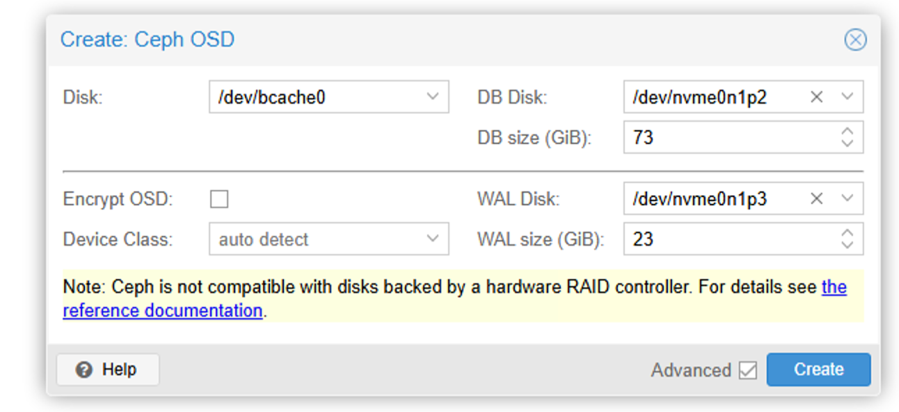

磁盘选择bcache，DB disk选择我们的磁盘分区，注意这里的DB SIZE需要指定。我们是600G空间做db，8个硬盘，差不多每个硬盘75G，这里我们设置为73。

Wal Disk 选择WAL分区，size 我们指定为23G

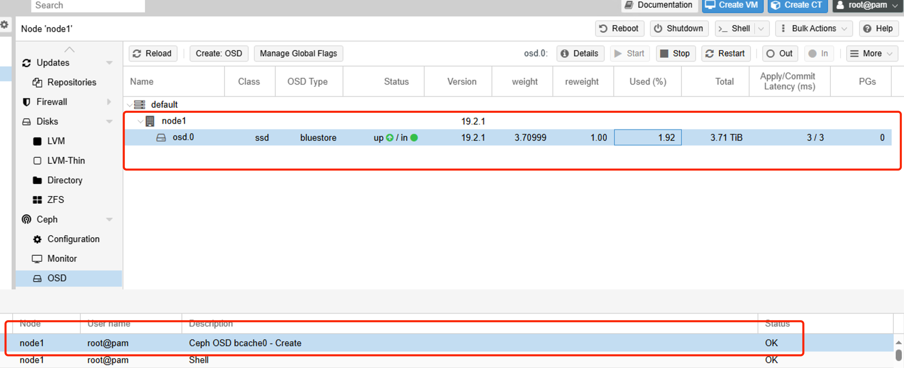

耐心等待即可创建成功。

我们也可以通过命令行快速创建

```
for disk in `seq 1 7`;do
pveceph osd create /dev/bcache$disk --db_dev /dev/nvme0n1p2 --db_dev_size 73 --wal_dev /dev/nvme0n1p3 --wal_dev_size 23
done
```

这样一个节点的ceph就创建好了
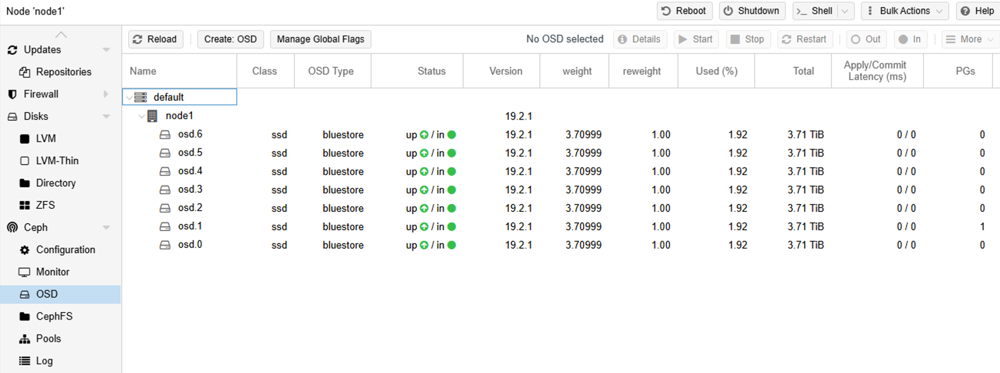

现在我们将上面的步骤，在其他的节点上执行


## 八、添加ceph 管理和监视器节点

在PVE的网页上，添加至少半数以上的节点，以保证服务的稳定运行。

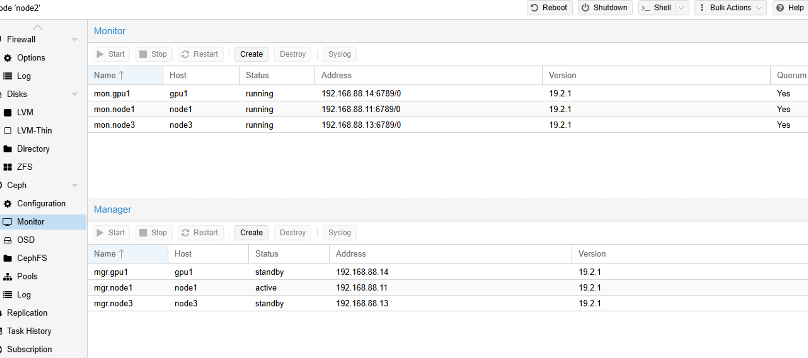


## 九、创建Ceph 池用于存放虚拟机磁盘

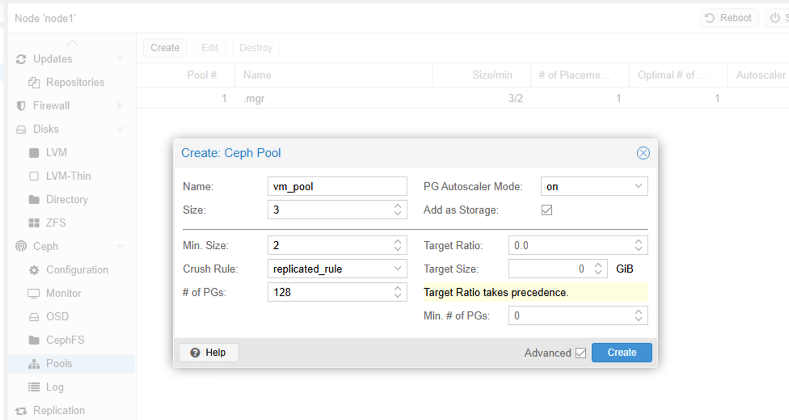

只要取个名字，就可以了。默认是3副本策略，最小副本数是2，即在有节点或者osd掉线时，如果副本数低于2，则集群会被冻结。


## 十、创建cephfs文件池

cephfs 是文件类型存储，可以存放iso镜像

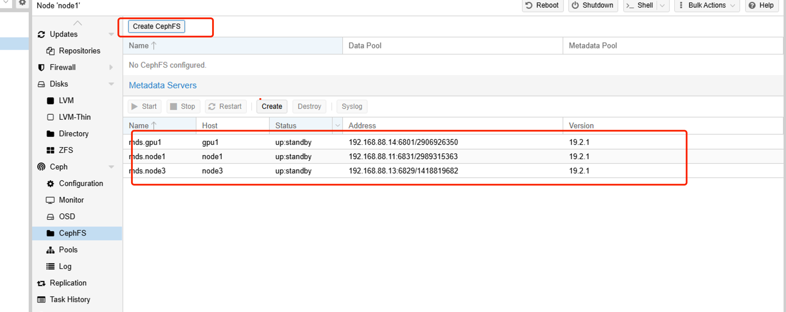

直接创建半数以上的mds服务器，随后创建一个cephfs类型的池即可。

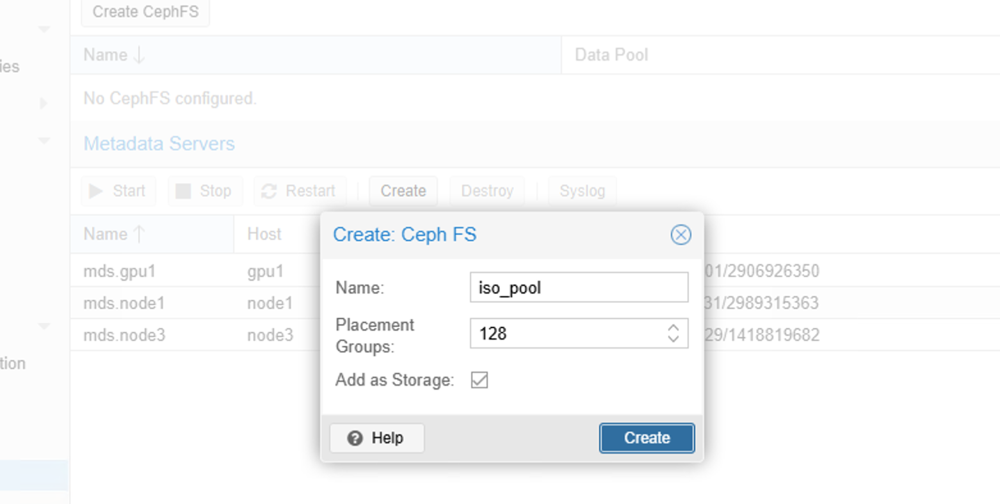

## 十一、配置NTP服务器

创建一个虚拟机，安装好chroy，并配置ntp服务

```
apt update && apt install chrony -y
echo "server ntp.aliyun.com iburst" >> /etc/chrony/conf.d/ntpserver.conf  # 使用阿里云作为上游ntp时间服务器
echo "allow 192.168.100.0/24" >> /etc/chrony/conf.d/ntpserver.conf # 允许某个网段访问
echo "local stratum 10" >> /etc/chrony/conf.d/ntpserver.conf # 允许本地授时
systemctl restart chrony
```

ntp服务器配置好了，将ntp服务器的地址写入集群

```
pvessh echo 'server 192.168.122.253 iburst' > /etc/chrony/sources.d/local-ntp-server.sources
pvessh systemctl restart chrony
```
之后我们可以验证

```
pvessh chronyc sources -v
```


配置好后，我们可以把这个虚拟机克隆一份，再修改这个虚拟机的ip，这样集群就有2个NTP时间服务器，稳定性更高。
