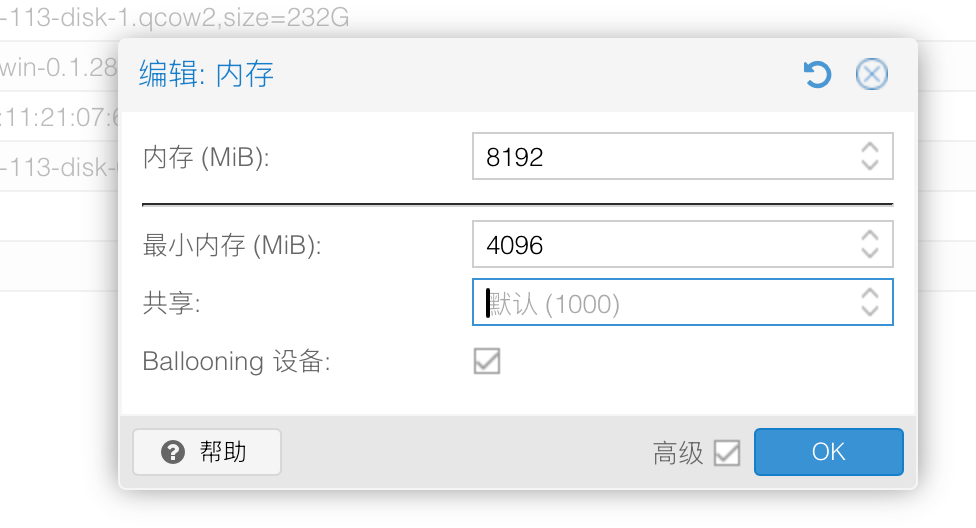
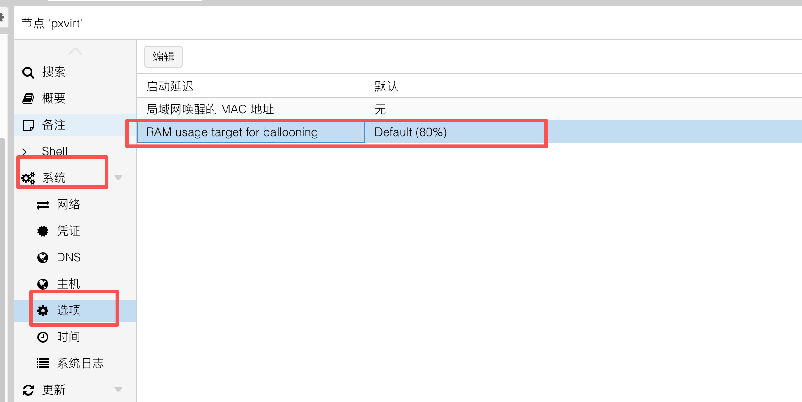

# Proxmox VE 动态内存方案解析

各个厂商都有自己的内存优化方案，尽可能的增加内存的使用率！

在虚拟化场景里，物理内存几乎永远是最稀缺的资源。CPU 可以超分（一核多用），磁盘可以精简置备，唯独内存一旦分配出去就被实打实占用。为了在有限的物理内存上跑更多的虚拟机，KVM/QEMU（也就是 Proxmox VE 底层使用的虚拟化引擎）提供了两套互补的机制：

- **内存气球（Ballooning）**：在宿主机与客户机之间动态地"借还"内存。
- **KSM 内存页合并（Kernel Samepage Merging）**：把多台虚拟机里内容完全相同的内存页合并成一份。


## 1. KVM ballooning 内存



这个页面大家不会陌生，配置 PVE VM 的内存。

那么 ballooning 是什么？

内存气球 (ballooning) 是宿主机和客户机之间的接口机制，用于动态调整客户机的预留内存大小。

### 1.1 工作原理

气球的核心是客户机里运行的一个内核驱动 `virtio_balloon`。可以把它想象成虚拟机内部一个"会膨胀和收缩的气球"：

1. **充气（inflate）**：当宿主机内存不够用时，它会对虚拟机里的气球驱动说一句"你膨胀一点"。气球驱动收到后，就在虚拟机内部"征用"一批内存——就像往气球里吹气，气球在房间里越占越大，留给房间里其他人（虚拟机内的程序）的空间就越小。占完之后，气球驱动告诉宿主机："哦呀！这几块地方我占住了，其他人都不会用，你放心拿走就是了！"
2. **归还物理内存**：被气球占住的这些内存，虚拟机自己的程序已经用不到了。于是宿主机就把这部分**真正的物理内存收回去**，分给别的更需要的虚拟机，或留给宿主机自己用。气球占着的只是虚拟机里的"空壳地址"，背后已经没有真实内存撑着了。
3. **放气（deflate）**：等虚拟机自己又需要内存时，气球就"放气"变小，把之前占住的地方让出来还给虚拟机内部的程序使用。这时虚拟机一旦再用到这些地方，宿主机会重新分配真实物理内存补上。

气球本身不存数据，它的作用就是当一个"占位的活塞"，在宿主机和虚拟机之间来回腾挪内存。

整个过程**不需要暂停或重启虚拟机**，可以在运行时动态调整每台 VM 的可用内存。


### 1.2 Proxmox VE 中的自动气球

在 Proxmox 中，当你设置的"最小内存"小于"内存（最大值）"时，气球功能就被启用：

- **最大内存（Maximum）**：虚拟机启动时拿到的、也是它能使用的上限。
>注意，这里就是启动就全部拿到，不是虚拟机用多少就拿多少。
- **最小内存（Minimum）**：虚拟机在压力下能被压缩到的下限。Proxmox 保证不会从虚拟机拿走超过这个下限的内存。

`pvestatd` 守护进程会周期性地监控宿主机内存使用率，并尽量把它维持在一个**目标水位（target，默认 80%）**附近。这个 80% 可以调整的，而是节点配置项 `ballooning-target` 的默认值，可在节点级修改



他的代码逻辑是这样的


```perl
# 目标：把宿主机内存使用率维持在 target（默认 80%）
my $target = int($config->{'ballooning-target'} // 80);
# goal = 需要变动的量，正数表示可增、负数表示要回收
my $goal = int($hostmeminfo->{memtotal} * $target / 100 - $hostmeminfo->{memused});
```

- 当宿主机内存使用率**低于目标水位**（`goal` 为正）时，会逐步给客户机增加内存，直到其最大值；增内存时**优先满足有内存压力的虚拟机**。
- 当宿主机内存使用率**高于目标水位**（`goal` 为负）时，开始从开启了气球的虚拟机里回收内存（充气）；回收时**优先从空闲内存充足的虚拟机**下手。
- `goal` 绝对值在 **±10 MB** 以内时不做任何调整（死区），且每台 VM **每个周期最多变动 100 MB**（`maxchange`），以避免内存剧烈抖动。

具体分配由 `/usr/share/perl5/PVE/AutoBalloon.pm(欧拉版本为/usr/share/perl5/vendor_perl/PVE/AutoBalloon.pm)` 的 `compute_alg1` 完成，依据每台 VM 的 **shares（份额，默认 1000）** 权重按比例分配：每台 VM 先保底拿到自己的"最小内存"，**超出最小值的部分再按 shares 比例瓜分**：

```perl
my $shares  = $d->{shares} || 1000;
my $desired = $d->{balloon_min} + int(($alloc_new / $shares_total) * $shares);
```

把某台 VM 的 `shares` 设为 **0** 可让它完全不参与自动气球（保留满内存）；没装气球驱动、未设置最小内存、或正在迁移的 VM 也会被跳过。

读者也可以在虚拟机的 Monitor 标签里手动测试气球，命令是 `balloon <目标内存MB>`，让气球驱动尝试收敛到指定大小。

### 1.3 气球还能上报内存统计

virtio-balloon 设备除了"借还"内存，还能向宿主机上报客户机的内存统计，便于宿主机做出准确的调度。通过调用qemu-ga通信接口，拿到系统准确的内存数据。

而一些没有安装`qemu-guest-tools`的系统，就会出现内存面板显示占用80%，然而虚拟机内存才占用20%，这种不一致的现象！

### 1.4 现象与表现

正常负载下，气球的开销几乎可以忽略（通常 < 3% CPU 开销）。开启气球后，**空闲虚拟机的内存占用可下降约 40–60%**，从而让同样的硬件多跑约 30% 的虚拟机（可能会更高）。

但当宿主机内存真正吃紧、气球被激进充气时，会出现一系列"内存压力"的连锁表现，本质上是**宿主机在用不完整的信息替客户机做性能取舍**——它只看得见"页"，看不见哪些页对应用是"热"的：

1. **缓存先被清空**：客户机内核首先回收文件缓存，原本靠缓存命中的负载（数据库、文件服务）性能骤降。
2. **触发 Swap**：缓存清光后，回收进一步压到工作集，引发客户机内部 swap，应用响应抖动且不可预测。
3. **OOM 风险**：如果气球设置过于激进、最小内存设得太低，客户机内部的 OOM Killer 可能被触发，杀掉重要进程（数据库自己往往就是评分最高的"受害者"）。

因此实践中务必：**为虚拟机设置合理的最小内存下限**，确保到达下限后不会再被继续抢占，以保证客户机稳定、避免 OOM。对延迟敏感或数据库类负载，建议**直接关闭气球、按需固定内存、并为宿主机留足余量**。

### 1.5 几个重要限制

- **客户机必须装有气球驱动**。Linux 客户机一般内置 `virtio_balloon`；Windows 客户机需安装 VirtIO 驱动。没装驱动，气球设备形同虚设。
- **气球与 PCI 直通（PCI passthrough / VFIO）不兼容**，因为直通设备需要固定的内存地址。
- 客户机在宿主机放气之前**无法自行索回内存**，所以一旦充气过度，恢复有延迟。


## 2 KSM 内存页合并

如果说气球解决的是"把不用的内存还回去"，那么 KSM 解决的是另一个问题：**多台虚拟机里有大量内容完全相同的内存页（比如相同的操作系统、相同的库、相同的运行时），为什么要存很多份？领导说这太浪费了！你得给我整改！**

KSM（Kernel Samepage Merging，内核同页合并）是 Linux 内核的一项内存去重功能，让宿主机把多个进程或多台虚拟机中**内容相同**的物理页合并为一份共享页。

### 2.1 工作原理

好比一栋楼里住了 10 个人，每人手里都有一本一模一样的字典。与其让每个人都占一格书架，不如把这 10 本合并成 1 本放在公共书架，谁要查就去查同一本——省下了 9 本的空间。KSM 干的就是这件事，只不过"字典"换成了内存页，类似于zfs的去重之类的。

宿主机里有个后台服务（内核线程 `ksmd`），它会一遍遍地扫描虚拟机的内存，做三件事：

1. **找出哪些内存可以参与合并**：虚拟机的内存被事先标记成"可以拿来比对合并"（这一步由 QEMU 在分配内存时完成）。
2. **逐页比对内容**：`ksmd` 把这些内存一页一页地比，看哪些页的内容**一模一样**（比如多台虚拟机都加载了相同的系统文件、相同的库）。
3. **合并成一份**：一旦发现内容相同的多页，就只**留下一份真实内存**，让原来那几页都指向这同一份，多出来的内存就释放出来给别处用。

>KSM 用的是"写时复制（Copy-on-Write）"保护：共享页是只读的，当虚拟机要去改动这块内存的时候，谁想写它，系统就**立刻单独给它复制一份新的**去改，原来那份共享内存纹丝不动。整个合并过程对虚拟机是完全透明的，数据不会串、也不会丢。

### 2.2 关键参数（位于 `/sys/kernel/mm/ksm/`）

- `run`：`1` = 运行 ksmd；`0` = 停止扫描但**保留**已合并的页；`2` = 停止并**拆解**所有已合并页（unmerge）。
- `pages_to_scan`：每次睡眠前扫描多少页（Proxmox 默认约 100）。
- `sleep_millisecs`：两次扫描之间睡多少毫秒。
- `merge_across_nodes`：是否允许跨 NUMA 节点合并。关闭后只合并同一 NUMA 节点内的页，避免跨节点访问带来的延迟。

监控指标：

- `pages_shared`：当前有多少个"共享页"被实际使用（即合并后保留的物理页数）。
- `pages_sharing`：有多少处映射在共用这些共享页（**这个数字越大，省下的内存越多**）。
- `pages_unshared`：反复检查但仍是唯一、没法合并的页。
- `pages_volatile`：变化太快、无法放进树里的页。
- `full_scans`：所有可合并区域被完整扫描了多少遍。

### 2.3 Proxmox VE 中的 KSM 与 ksmtuned

Proxmox 通过 `ksmtuned` 服务来**按需动态调节** KSM，而不是一直全速扫描。可以用 `systemctl status ksmtuned` 查看状态。其默认配置（`/etc/ksmtuned.conf`）的关键逻辑由这几个参数决定：

- `KSM_THRES_COEF=20`：当宿主机**空闲内存低于总量的 20%** 时，KSM 才开始介入合并。
- `KSM_NPAGES_BOOST=300`：空闲内存低于阈值时，把每次扫描的页数往上加 300，加快去重。
- `KSM_NPAGES_DECAY=-50`：空闲内存高于阈值时，每次扫描页数减 50，逐步降速。
- `KSM_NPAGES_MIN=64` / `KSM_NPAGES_MAX=1250`：扫描页数的下限与上限。
- `KSM_SLEEP_MSEC=10`：扫描间隔基准。

也就是说，平时宿主机内存富裕时 KSM 基本不工作；只有内存压力上来时才逐步加速合并。

### 2.4 现象与表现

KSM 的收益在"很多相似虚拟机"的场景下非常可观，特别是通过模版克隆的一些虚拟机或者场景。

代价是需要CPU去运算：`ksmd` 扫描和比对内存是要花 CPU 的，本质上是"用 CPU 换内存"。不过新版内核引入了 **Smart Scan**——如果某页上一轮没合并成功，下一轮就跳过它，显著降低了无谓扫描的开销。

> **重要：KSM 与大页（HugePages）不兼容。**
> KSM 只能合并普通的 4KB 小页，它**不会去扫描、也无法合并大页（HugePages，常见的 2MB / 1GB 页）**。所以如果你给虚拟机开启了大页（例如 PVE 里设置了 `hugepages` 选项、或后端用 hugetlbfs/1G 静态大页来跑数据库、DPDK 等），这部分内存对 KSM 来说是"看不见"的，**几乎拿不到任何内存合并收益**。
>
> **大页和 KSM 是两条相反的优化路线**：
> - 大页追求的是"性能优先"——用更大的页减少 TLB miss、提升内存访问效率，代价是内存被整块锁定、不灵活；
> - KSM 追求的是"密度优先"——用更细的粒度去重、省内存，代价是花 CPU 扫描。
>
> 两者的目标和粒度天然冲突，所以**要么为高性能负载开大页（关掉对该 VM 的 KSM 预期），要么为高密度场景开 KSM（不要用大页）**，不要指望同一块内存上两者兼得。透明大页（THP）情况略好——内核在合并时可以把透明大页拆回小页来参与 KSM，但**显式分配的静态大页则完全无法合并**。

### 2.5 安全注意事项

KSM 会引入**跨虚拟机的侧信道（side-channel）风险**：由于被合并的页是写时复制的，**首次写入一个"恰好和别的 VM 相同"的页会比写入普通页慢**（因为要触发 COW 复制）。攻击者可以利用这个时间差，从一台虚拟机推断出**同宿主机上另一台虚拟机里是否运行着某个特定软件、某个版本，甚至某些文件是否存在**。

- 早在 2011 年 Suzaki 等人就利用 KSM 在 KVM 上识别同驻虚拟机里的用户数据和软件。
- 相关问题被收录为 **CVE-2021-3714**；内存去重还可被用来辅助 **Rowhammer** 类攻击。

因此 Proxmox 官方建议：**只有在你掌控宿主机上所有虚拟机时**才启用 KSM；对**多租户/公有云**这类需要租户隔离的环境，应当关闭 KSM 以增强隔离性。

**关闭 KSM 的方法：**

- 节点级停用服务：`systemctl disable --now ksmtuned`
- 拆解已合并的页：`echo 2 > /sys/kernel/mm/ksm/run`

## 小结

| 维度 | 内存气球 Ballooning | KSM 内存页合并 |
| --- | --- | --- |
| 解决的问题 | 把虚拟机暂时不用的内存还给宿主机/其他 VM | 把多台 VM 内容相同的内存页合并成一份 |
| 谁来决策 | 宿主机下指令，客户机自己选择释放哪些页 | 宿主机内核扫描比对，对客户机透明 |
| 触发条件（PVE） | 宿主机内存使用率超过 80% | 宿主机空闲内存低于 ~20% |
| 主要代价 | 客户机缓存清空、Swap、OOM 风险 | 额外 CPU 开销、跨 VM 侧信道安全风险 |
| 依赖 | 客户机需装气球驱动；不兼容 PCI 直通 | 内容相似的 VM 越多收益越大 |
| 关键建议 | 设好最小内存，关键/数据库 VM 关闭气球 | 仅在单租户、可信环境启用 |

两者可以同时开启、互为补充：气球负责"宏观"地在 VM 之间挪内存，KSM 负责"微观"地消除重复页。但无论哪种，都建议**为宿主机保留足够的内存余量**，并对延迟敏感、内存敏感的关键业务做针对性配置，避免在内存高压下出现性能塌方或 OOM。

---

## 参考资料

1. [Dynamic Memory Management - Proxmox VE Wiki](https://pve.proxmox.com/wiki/Dynamic_Memory_Management)
2. [Kernel Samepage Merging (KSM) - Proxmox VE Wiki](https://pve.proxmox.com/wiki/Kernel_Samepage_Merging_(KSM))
3. [Kernel Samepage Merging — The Linux Kernel documentation](https://docs.kernel.org/admin-guide/mm/ksm.html)
4. [Kernel same-page merging - Wikipedia](https://en.wikipedia.org/wiki/Kernel_same-page_merging)
5. [Memory ballooning and virtio_balloon driver in qemu-kvm — Humble Devassy Chirammal](https://www.humblec.com/memory-ballooning-and-virtio_balloon-driver-in-qemu-kvm/)
6. [Virtio balloon — Richard WM Jones](https://rwmj.wordpress.com/2010/07/17/virtio-balloon/)
7. [VirtIO Memory Ballooning — pmhahn](https://blog.pmhahn.de/virtio-balloon/)
8. [Virtio balloon memory statistics — QEMU documentation](https://www.qemu.org/docs/master/interop/virtio-balloon-stats.html)
9. [Projects/auto-ballooning — linux-kvm.org](https://www.linux-kvm.org/page/Projects/auto-ballooning)
10. [20.19. Memory Balloon Device — Red Hat RHEL 6 Virtualization Administration Guide](https://docs.redhat.com/en/documentation/red_hat_enterprise_linux/6/html/virtualization_administration_guide/section-libvirt-dom-xml-memory-baloon-device)
11. [Proxmox: The 'Ballooning' Setting That Creates Fake Memory Pressure — cr0x.net](https://cr0x.net/en/proxmox-ballooning-fake-memory-pressure/)
12. [How Does Ballooning Work in Proxmox for Dynamic Memory Management? — Vinchin](https://www.vinchin.com/vm-tips/ballooning-proxmox.html)
13. [Proxmox Memory Management: Ballooning, KSM, NUMA, and Overcommit — ProxmoxR Blog](https://proxmoxr.com/blog/proxmox-memory-management)
14. [Evaluate KSM and Ballooning features in Proxmox VE — credativ](https://www.credativ.de/en/blog/credativ-inside/evaluate-ksm-and-ballooning-features-in-proxmox-ve/)
15. [Why set minimum RAM when you have Ballooning + KSM enabled? — Proxmox Support Forum](https://forum.proxmox.com/threads/why-set-minimum-ram-when-you-have-ballooning-ksm-enabled.79932/)
16. [8.4.2. The KSM Tuning Service — Red Hat RHEL 6 Virtualization Tuning and Optimization Guide](https://docs.redhat.com/en/documentation/red_hat_enterprise_linux/6/html/virtualization_tuning_and_optimization_guide/sect-ksm-the_ksm_tuning_service)
17. [Chapter 7. KSM — Red Hat RHEL 6 Virtualization Administration Guide](https://docs.redhat.com/en/documentation/red_hat_enterprise_linux/6/html/virtualization_administration_guide/chap-ksm)
18. [How to: Tune KSM Sharing in Proxmox VE — dannyda.com](https://dannyda.com/2020/12/10/how-to-tune-ksm-kernel-samepage-merging-sharing-in-proxmox-ve-pve/)
19. [ksmtuned source — Anthony25/ksmtuned (GitHub)](https://github.com/Anthony25/ksmtuned/blob/master/ksmtuned)
20. [virtio-balloon: add support for free page reporting (v21) — QEMU devel](https://lists.gnu.org/archive/html/qemu-devel/2020-04/msg03760.html)
21. [Virtio-(balloon\|pmem\|mem): Managing Guest Memory — KVM Forum 2020](https://static.sched.com/hosted_files/kvmforum2020/8e/KVM%20Forum%202020%20Virtio-(balloon%20pmem%20mem)%20Managing%20Guest%20Memory.pdf)
22. [Traditional Memory Balloon Device — OASIS virtio v1.3 spec](https://docs.oasis-open.org/virtio/virtio/v1.3/csd01/tex/device-types/balloon/description.tex)
23. [The Role of KSM in KVM Memory Optimization — DoHost](https://dohost.us/index.php/2025/09/09/the-role-of-ksm-kernel-samepage-merging-in-kvm-memory-optimization/)
24. [Memory Deduplication as a Threat to the Guest OS — KTH DiVA](https://kth.diva-portal.org/smash/get/diva2:1060434/FULLTEXT01)
25. [A memory-deduplication side-channel attack to detect applications in co-resident VMs — ACM SAC 2018](https://dl.acm.org/doi/10.1145/3167132.3167151)
26. [Remote Memory-Deduplication Attacks — NDSS Symposium](https://www.ndss-symposium.org/wp-content/uploads/2022-81-paper.pdf)
27. [Smart scanning mode for KSM](https://lwn.net/Articles/945839/)